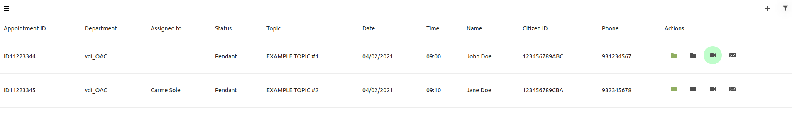
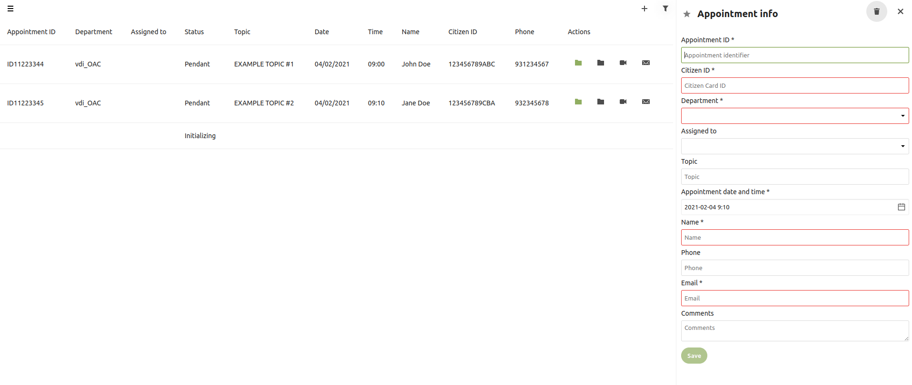
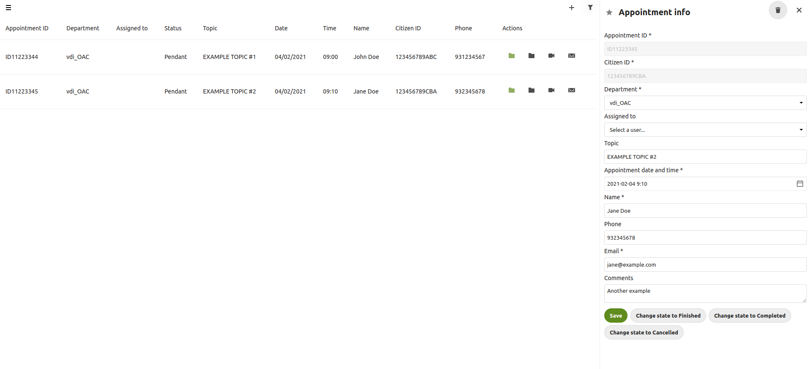

# VTramit

## EN

VTramit is a [Nextcloud](https://nextcloud.com) App for handling appointments with videoconferences on [Jitsi](https://jitsi.org).

This APP has been released under AGPL v3 license, made by mutual agreement between [FLOSS](https://floss.cat) and [Barcelona City Council](https://ajuntament.barcelona.cat), under the project "Atenció per Videotrucada a la Ciutadania", following the principles of Agile Development and [Public Money, Public Code](https://publiccode.eu) initiative, adhering to the principles of the [Ethical Digital Standards](https://citiesfordigitalrights.org) of Barcelona City Council.

At the present moment it is being used by different departments of the municipality to allow citizens to bring support and carry out administrative procedures through video calls, and several other municipalities that have joined the project in order to contribute to its development and bring the service to their citizens.

This project has a strong focus on privacy, security and compliance with the current legal framework. Feel free to contact us if you need further assistance.

## ES

Vtramit es una aplicación de [Nextcloud](https://nextcloud.com) para gestionar citas por videoconferencias con [Jitsi](https://jitsi.org).

Esta aplicación ha sido liberada bajo la licencia AGPL v3, realizado por mútuo acuerdo entre [FLOSS](https://floss.cat) y el [Ayuntamiento de Barcelona](https://ajuntament.barcelona.cat), en el marco del proyecto "Atenció per Videotrucada a la Ciutadania", siguiendo los principios del desarrollo Agile y la iniciativa [Public Money, Public Code](https://publiccode.eu), en consonancia con los principos de [Ethical Digital Standards](https://citiesfordigitalrights.org) del Ayuntamiento de Barcelona.

En estos momentos se está utilizando por parte de diferentes departamentos de la ciudad para permitir asistencia y tramitación por videollamada, así como varios otros ayuntamientos que se han sumado al proyecto con el fin de contribuir a su desarrollo y ofrecer el servicio de tramitación por videollamada.

Este proyecto tiene un fuerte foco en privacidad, seguridad y cumplimiento del marco legal vigente. No duden en contactarnos si necesitan ayuda adicional.

## CA

Vtramit és una aplicació de [Nextcloud](https://nextcloud.com) per la gestió de cites per videotrucada amb [Jitsi](https://jitsi.org).

Aquesta aplicació ha estat alliberada sota la llicència AGPL v3, realitzat de comú acord entre [FLOSS](https://floss.cat) i l'[Ajuntament de Barcelona](https://ajuntament.barcelona.cat), dins del marc del projecte d'"Atenció per Videotrucada a la Ciutadania", seguint els principis del desenvolupament Agile i la iniciativa [Public Money, Public Code](https://publiccode.eu), en consonància amb els principis del [Ethical Digital Standards](https://citiesfordigitalrights.org) de l'Ajuntament de Barcelona.

En aquests moments s'està emprant per part de diferents departaments de la ciutat per permetre l'assistència i tramitació per videotrucada, així com d'altres ajuntaments que s'han sumat al projecte amb l'objectiu de contribuïr en el seu desenvolupament i oferir el servei de tramitació per videotrucada.

Aquest projecte té un fort focus en privacitat, seguretat i compliment del marc legal vigent. No dubtin en contactar-nos si necessiten ajuda addicional.

------------------

**Example of a Citizen waiting to be attended:**

**Add a new appointment:**

**Edit an appointment:**

This is an ongoing project, check the [TODO](doc/TODO.md) list and the [ROADMAP](doc/ROADMAP.md) and feel free to send us your feature requests here on GitHub.

In order to ease testing and for security reasons, we're only going to support up to date versions of Nextcloud. Please, upgrade regularly!

## INSTALL

Check [INSTALL](doc/INSTALL.md)

## CONTRIBUTORS

[List of Contributors](doc/CONTRIBUTORS.md)

