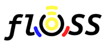
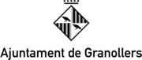

# VTramit Contributors

<table>
<tr><td align="center"><a href="https://ajuntament.barcelona.cat" target="_blank"> <strong>Ajuntament de Barcelona</strong></a></td>
<td>Original idea, project definition and funding. Legal, Privacy and Security advise.</td></tr>
<tr><td align="center"><a href="https://floss.cat" target="_blank"> <strong>FLOSS</strong></a></td>
<td>Architecture, requirements analysys and programming. Translation into Galician, Portuguese and Italian.</td></tr>
<tr><td align="center"><a href="https://rubi.cat" target="_blank"> <strong>Ajuntament de Rubí</strong></a></td>
<td>Beta testing new features. Integration with 3rd party booking solutions.</td></tr>
<tr><td align="center"><a href="https://www.pamplona.es" target="_blank"> <strong>Ayuntamiento de Pamplona</strong></a></td>
<td>Cleaning up code. Translation into Basque.</td></tr>
<tr><td align="center"><a href="https://granollers.cat" target="_blank"> <strong>Ajuntament de Granollers</strong></td>
<td>Testing under an extense number of use cases. Contributions to project Roadmap.</td></tr>
<tr><td align="center"><a href="https://santcugat.cat" target="_blank"> <strong>Ajuntament de Sant Cugat</strong></td>
<td>Contibutions to project Roadmap. Betatesting of GA release.</td></tr>
</table>
